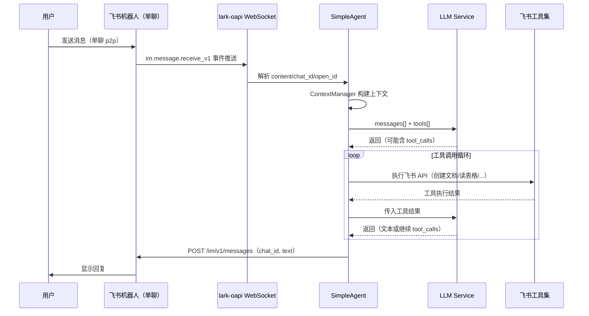
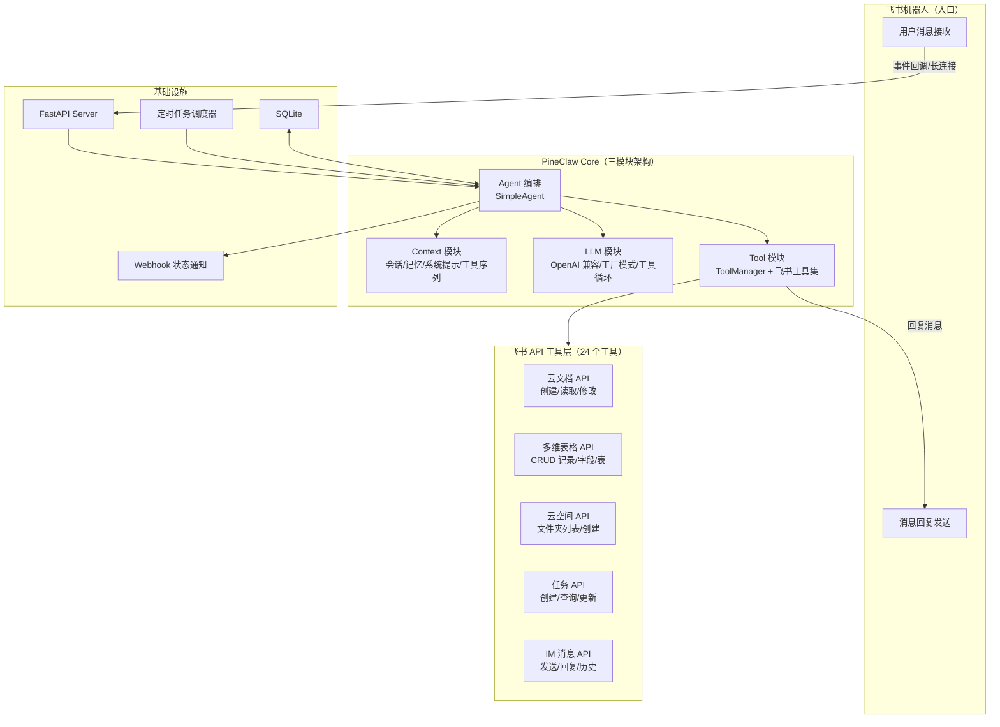

# PineClaw 总体架构设计

> PineClaw —— 基于飞书协同空间的轻量级 AI Agent  
> 参考项目：[NanoClaw](https://github.com/qwibitai/nanoclaw)（架构理念）、[pineclaw-node-templte](../pineclaw-node-templte)（三模块架构）

---

## 1. 项目定位

一个轻量级个人 AI Agent，核心特点：

- **飞书作为协同空间**：以飞书机器人为唯一入口，Agent 能操作飞书的文档、多维表格、云空间、任务、消息
- **小而可理解**：参考 NanoClaw 的哲学——代码量小到你能完全理解，不使用任何重型框架
- **三模块架构**：Context（上下文）/ Tool（工具）/ LLM（大模型），参考 pineclaw-node-templte 的设计
- **Python 原生**：Python 3.12+，uv 包管理，FastAPI 提供 API 层
- **Docker 部署**：一键容器化运行

## 2. 核心交互流程

**采用单聊（p2p）模式**：用户直接与飞书机器人一对一对话，不走群聊。

### 2.1 消息接收

飞书通过 `im.message.receive_v1` 事件推送用户消息。采用 **长连接模式**（lark-oapi 内置 WebSocket），无需公网 IP。

**事件体关键字段**（来自飞书官方文档）：

```json
{
    "schema": "2.0",
    "header": {
        "event_id": "5e3702a84e847582be8db7fb73283c02",
        "event_type": "im.message.receive_v1",
        "app_id": "cli_9f5343c580712544"
    },
    "event": {
        "sender": {
            "sender_id": {
                "open_id": "ou_84aad35d084aa403a838cf73ee18467",
                "user_id": "e33ggbyz"
            },
            "sender_type": "user"
        },
        "message": {
            "message_id": "om_5ce6d572455d361153b7cb51da133945",
            "chat_id": "oc_5ce6d572455d361153b7xx51da133945",
            "chat_type": "p2p",
            "message_type": "text",
            "content": "{\"text\":\"帮我创建一个文档\"}"
        }
    }
}
```

Agent 从事件体中提取：
- `message.content` —— 用户发送的文本（JSON 字符串，需 `json.loads`）
- `message.chat_id` —— 会话 ID，用于回复消息
- `message.message_id` —— 消息 ID，可用于消息去重（幂等）
- `sender.sender_id.open_id` —— 发送者，用于识别用户

### 2.2 消息发送

Agent 处理完成后，通过 `POST /open-apis/im/v1/messages` 发送消息回单聊会话。

**请求体**（飞书官方文档格式）：

```json
{
    "receive_id": "oc_5ce6d572455d361153b7xx51da133945",
    "msg_type": "text",
    "content": "{\"text\":\"文档已创建：https://xxx.feishu.cn/docx/xxx\"}"
}
```

关键点：
- `receive_id_type` 查询参数设为 `chat_id`（单聊场景直接用 chat_id）
- `content` 是 **JSON 字符串**（需 `json.dumps` 后传入）
- `msg_type` 支持：`text`（纯文本）、`post`（富文本）、`interactive`（卡片）
- 认证：`tenant_access_token`（lark-oapi SDK 自动管理）
- 限频：同一用户 5 QPS

**文本消息 content 支持的格式**：
- 换行：`\n`
- 加粗：`**文本**`
- 斜体：`<i>文本</i>`
- 超链接：`[文本](https://url)`
- @用户：`<at user_id="ou_xxx">用户名</at>`

### 2.3 完整流程

```
用户在飞书中直接给机器人发消息（单聊 p2p）
       │
       ▼
飞书 WebSocket 长连接推送 im.message.receive_v1 事件
       │
       ▼  解析 event.message.content（JSON 字符串）
       │  提取 chat_id、open_id、message_type
       │
       ▼
  SimpleAgent
    ├── ContextManager 构建上下文
    │     ├── system_prompt（系统提示词）
    │     ├── memory（历史记忆）
    │     ├── conversation（会话历史）
    │     └── tool_sequence（工具调用序列）
    │
    ├── LLM Service 推理
    │     └── OpenAI 兼容接口（DeepSeek / OpenAI / ...）
    │
    └── Tool Loop 工具循环
          ├── LLM 返回 tool_calls
          ├── ToolManager 执行飞书工具
          │     ├── 创建文档 / 读取文档
          │     ├── 操作多维表格
          │     ├── 浏览云空间文件夹
          │     ├── 创建任务
          │     └── ...
          ├── 将工具结果回传 LLM
          └── 重复直到 LLM 返回纯文本
                │
                ▼
  POST /im/v1/messages（receive_id=chat_id, msg_type=text）
                │
                ▼
          用户在飞书单聊中看到回复
```

**时序图（Mermaid）**：



### 2.4 Python 代码示例（消息收发核心）

基于 lark-oapi 官方文档的标准用法：

```python
import json
import lark_oapi as lark
from lark_oapi.api.im.v1 import *

# 接收消息事件处理
def on_message_receive(data: P2ImMessageReceiveV1) -> None:
    msg = data.event.message
    if msg.message_type != "text":
        return
    
    user_text = json.loads(msg.content)["text"]
    chat_id = msg.chat_id
    
    # ... Agent 处理逻辑（构建上下文 -> LLM -> 工具循环）...
    reply_text = agent.run(user_text)
    
    # 发送回复（单聊，receive_id_type=chat_id）
    request = (
        CreateMessageRequest.builder()
        .receive_id_type("chat_id")
        .request_body(
            CreateMessageRequestBody.builder()
            .receive_id(chat_id)
            .msg_type("text")
            .content(json.dumps({"text": reply_text}))
            .build()
        )
        .build()
    )
    response = client.im.v1.message.create(request)

# 注册事件 + 启动长连接
event_handler = (
    lark.EventDispatcherHandler.builder("", "")
    .register_p2_im_message_receive_v1(on_message_receive)
    .build()
)

client = lark.Client.builder().app_id("APP_ID").app_secret("APP_SECRET").build()
ws_client = lark.ws.Client("APP_ID", "APP_SECRET", event_handler=event_handler)
ws_client.start()
```

## 3. 技术栈

| 组件 | 技术选型 | 说明 |
|------|---------|------|
| 语言 | Python 3.12+ | 异步原生支持 |
| 包管理 | uv | 快速、现代的 Python 包管理器 |
| API 框架 | FastAPI + uvicorn | 异步原生、自动 OpenAPI 文档、类型校验 |
| 飞书 SDK | lark-oapi v1.5.3 | 官方 Python SDK，处理 token 管理、事件订阅 |
| 本地存储 | SQLite | 会话、消息、记忆、统计数据 |
| LLM 调用 | OpenAI 兼容接口 | 支持 DeepSeek、OpenAI、其他兼容模型 |
| 容器化 | Docker + docker-compose | 一键部署 |

## 4. 架构设计



## 5. 三模块架构详解

### 5.1 Context 模块

**职责**：管理和组装所有上下文类型，输出 LLM 可用的 messages 序列。

| 上下文类型 | 文件 | 说明 |
|-----------|------|------|
| SYSTEM_PROMPT | `system_prompt.py` | 系统提示词，定义 Agent 角色和行为 |
| CONVERSATION | `conversation.py` | 会话历史消息（user/assistant 交替） |
| MEMORY | `memory.py` | 长期记忆，从飞书云文档 memory.md 加载（详见 [记忆模块设计](memory-design.md)） |
| TOOL_SEQUENCE | `tool_sequence.py` | 工具调用和结果的消息序列 |

**ContextManager** 负责：
- 管理多种上下文模块的生命周期
- `get_context()` 方法将所有上下文组装为 `list[Message]`
- 组装顺序：system_prompt -> memory -> conversation -> tool_sequence

```python
class ContextManager:
    def __init__(self):
        self.system_prompt = SystemPromptContext()
        self.conversation = ConversationContext()
        self.memory = MemoryContext()
        self.tool_sequence = ToolSequenceContext()

    def add(self, content, context_type, **metadata): ...
    def get_context(self) -> list[dict]: ...
    def clear_tool_sequence(self): ...
```

### 5.2 LLM 模块

**职责**：统一大模型调用、工具调用循环。

- **factory.py**：`create_llm_service(config)` 根据配置创建对应的 LLM 服务实例
- **services/openai_service.py**：实现 OpenAI 兼容接口调用（覆盖 DeepSeek、OpenAI 等）
- **utils/tool_loop.py**：核心的工具调用循环逻辑

**工具循环流程**（`execute_tool_loop`）：

```
1. 发送 messages + tools 给 LLM
2. 如果 LLM 返回 tool_calls：
   a. 遍历每个 tool_call
   b. 通过 ToolManager 执行对应工具
   c. 将工具结果作为 tool message 追加到 messages
   d. 回到步骤 1
3. 如果 LLM 返回纯文本：结束循环，返回文本
```

**接口定义**：

```python
class ILLMService(Protocol):
    async def complete(
        self,
        messages: list[dict],
        tools: list[dict] | None = None,
        **kwargs
    ) -> LLMResponse: ...
```

### 5.3 Tool 模块

**职责**：工具的定义、注册、执行，以及格式化为 LLM 可用的 function calling 格式。

- **types.py**：`InternalTool` 数据结构，包含 name、description、parameters、handler
- **manager.py**：`ToolManager` 负责注册工具、执行工具、输出 OpenAI 格式的 tools 定义
- **feishu/**：所有飞书 API 封装为 Agent 工具

**ToolManager 核心方法**：

```python
class ToolManager:
    def register(self, name, definition, handler, category): ...
    def execute(self, name, arguments) -> str: ...
    def get_formatted_tools(self) -> list[dict]: ...  # OpenAI tools 格式
```

**飞书工具详细设计**：详见 [飞书工具封装设计文档](feishu-tools-design.md)

## 6. Channel 层

参考 NanoClaw 的 Channel 自注册模式，飞书作为第一个（也是目前唯一的）Channel。

**交互模式**：**单聊（p2p）**，用户直接与机器人一对一对话。

**设计要点**：
- `registry.py`：Channel 工厂注册表，支持自注册模式
- `channels/feishu/`：飞书 Channel 实现
- 架构上预留扩展其他 Channel 的能力

**飞书消息接收方式**：
- **长连接模式**（默认、推荐）：lark-oapi 内置 WebSocket，无需公网 IP、无需域名
- **Webhook 模式**（生产备选）：飞书推送事件到 FastAPI 的 `/api/webhook/feishu` 端点

**事件处理流程**：

```python
class FeishuChannel:
    name = "feishu"

    def __init__(self, app_id: str, app_secret: str):
        self.client = lark.Client.builder() \
            .app_id(app_id).app_secret(app_secret).build()
        self.ws_client = None

    async def connect(self):
        """启动 lark-oapi WebSocket 长连接，注册 im.message.receive_v1"""
        event_handler = (
            lark.EventDispatcherHandler.builder("", "")
            .register_p2_im_message_receive_v1(self._on_message)
            .build()
        )
        self.ws_client = lark.ws.Client(
            self.app_id, self.app_secret,
            event_handler=event_handler
        )
        self.ws_client.start()

    def _on_message(self, data: P2ImMessageReceiveV1):
        """事件回调：提取单聊消息，交给 Agent 处理"""
        msg = data.event.message
        if msg.chat_type != "p2p":
            return  # 仅处理单聊
        user_text = json.loads(msg.content).get("text", "")
        # -> agent.run(user_text, chat_id=msg.chat_id, ...)

    async def send_message(self, chat_id: str, content: str,
                           msg_type: str = "text"):
        """通过 IM API 发送消息到单聊会话"""
        req = (
            CreateMessageRequest.builder()
            .receive_id_type("chat_id")
            .request_body(
                CreateMessageRequestBody.builder()
                .receive_id(chat_id)
                .msg_type(msg_type)
                .content(json.dumps({"text": content}))
                .build()
            )
            .build()
        )
        return self.client.im.v1.message.create(req)

    async def disconnect(self):
        if self.ws_client:
            self.ws_client.stop()

    def is_connected(self) -> bool:
        return self.ws_client is not None
```

## 7. 目录结构

```
PineClaw/
├── pyproject.toml              # uv 项目配置
├── .env.example                # 环境变量示例
├── Dockerfile
├── docker-compose.yml
├── main.py                     # 入口：启动 FastAPI + Channel + 调度器
│
├── docs/
│   ├── architecture.md         # 本文档：总体架构设计
│   ├── feishu-tools-design.md  # 飞书工具封装详细设计
│   └── memory-design.md        # 记忆模块详细设计
│
├── config/
│   ├── __init__.py
│   └── settings.py             # 配置管理（环境变量、常量）
│
├── core/
│   ├── __init__.py
│   ├── llm/                    # LLM 模块
│   │   ├── __init__.py
│   │   ├── types.py            # LLMConfig, LLMResponse, ILLMService
│   │   ├── factory.py          # create_llm_service(config)
│   │   ├── services/
│   │   │   ├── __init__.py
│   │   │   ├── base.py         # BaseLLMService 抽象类
│   │   │   └── openai_service.py   # OpenAI 兼容实现
│   │   └── utils/
│   │       ├── __init__.py
│   │       └── tool_loop.py    # execute_tool_loop 工具调用循环
│   │
│   ├── context/                # 上下文模块
│   │   ├── __init__.py
│   │   ├── types.py            # ContextType 枚举
│   │   ├── manager.py          # ContextManager
│   │   ├── base.py             # BaseContext 抽象类
│   │   └── modules/
│   │       ├── __init__.py
│   │       ├── conversation.py     # 会话历史
│   │       ├── memory.py           # 记忆上下文
│   │       ├── system_prompt.py    # 系统提示词
│   │       └── tool_sequence.py    # 工具调用序列
│   │
│   ├── tool/                   # 工具模块
│   │   ├── __init__.py
│   │   ├── types.py            # InternalTool 类型定义
│   │   ├── manager.py          # ToolManager（注册/执行/格式化）
│   │   └── feishu/             # 飞书工具集（详见 feishu-tools-design.md）
│   │       ├── __init__.py     # register_feishu_tools() 统一注册
│   │       ├── client.py       # FeishuClient 基础层
│   │       ├── message.py      # IM 消息（3 个工具）
│   │       ├── doc.py          # 云文档（5 个工具）
│   │       ├── bitable.py      # 多维表格（7 个工具）
│   │       ├── drive.py        # 云空间（4 个工具）
│   │       ├── task.py         # 任务（4 个工具）
│   │       └── export.py       # 导出（1 个工具，第二期）
│   │
│   └── agent/                  # Agent 编排
│       ├── __init__.py
│       └── simple_agent.py     # SimpleAgent（tool loop 驱动）
│
├── channels/                   # Channel 层
│   ├── __init__.py
│   ├── registry.py             # Channel 工厂注册表
│   ├── types.py                # Channel 接口定义
│   └── feishu/
│       ├── __init__.py         # 自注册
│       ├── channel.py          # FeishuChannel 实现
│       └── event_handler.py    # 飞书事件分发
│
├── scheduler/                  # 定时任务（第二期）
│   ├── __init__.py
│   └── task_scheduler.py
│
├── api/                        # FastAPI 路由
│   ├── __init__.py
│   ├── app.py                  # FastAPI app 创建
│   ├── routes/
│   │   ├── __init__.py
│   │   ├── webhook.py          # 飞书事件回调端点
│   │   ├── chat.py             # 手动触发对话（调试用）
│   │   └── health.py           # 健康检查
│   └── middleware.py           # 飞书签名验证
│
├── storage/
│   ├── __init__.py
│   └── db.py                   # SQLite（会话/消息/统计）
│
├── memory/                     # 记忆模块（详见 memory-design.md）
│   ├── __init__.py
│   ├── memory_store.py         # MemoryStore：飞书云文档缓存 + 同步
│   └── memory_context.py       # MemoryContext：注入 LLM 上下文
│
├── skills/                     # Skill 存放（第二期）
│
└── utils/
    ├── __init__.py
    ├── logger.py
    └── token_counter.py        # Token 消耗统计
```

## 8. 开发分期

### 第一期：核心可用（MVP）

**目标**：Agent 能通过飞书机器人对话，调用飞书 API 完成实际操作。

| 优先级 | 模块 | 内容 |
|--------|------|------|
| P0 | 项目骨架 | pyproject.toml (uv)、目录结构、config、.env.example、logger |
| P0 | LLM 模块 | types + factory + OpenAI 兼容 service + tool_loop |
| P0 | Context 模块 | ContextManager + conversation + system_prompt + tool_sequence |
| P0 | Tool 模块 | ToolManager + FeishuClient + 飞书工具集 23 个（不含导出） |
| P0 | Agent 编排 | SimpleAgent 完整流程 |
| P0 | 飞书 Channel | FeishuChannel + 事件处理（长连接 + Webhook） |
| P0 | FastAPI 层 | Webhook 端点 + 健康检查 + main.py 入口 |
| P1 | 记忆系统 | 飞书云文档 memory.md + 本地缓存（详见 [记忆模块设计](memory-design.md)） |
| P1 | Docker | Dockerfile + docker-compose.yml |

**第一期交付能力**：
- 在飞书 @机器人 发消息，Agent 智能回复
- Agent 可创建/读取/修改飞书文档
- Agent 可创建/读取/写入多维表格
- Agent 可浏览云空间文件夹（像 ls 一样）
- Agent 可创建飞书任务
- 长期记忆（用户画像/偏好/事实），存储在飞书云文档，每次对话自动注入
- Docker 一键部署

### 第二期：增强体验

**目标**：让 Agent 更智能、更安全、更可观测。

| 优先级 | 模块 | 内容 |
|--------|------|------|
| P2 | 定时任务 | cron / once / interval 调度器 |
| P2 | 消息总结 | 每日定时总结关键消息，写入任务看板 |
| P2 | Webhook 通知 | Agent 运行状态推送（开始/完成/错误） |
| P2 | Token 统计 | token + API 调用次数统计，10 条批量写入多维表格 |
| P3 | 权限控制 | 敏感操作需用户审批 |
| P3 | 记忆增强 | 记忆轮询同步（感知用户手动编辑）、多用户隔离、记忆大小自动精简 |
| P3 | 文件导出 | 导出 Markdown / 图文 |
| P3 | 代码库集成 | 拉取代码到本地环境 |
| P3 | Skill 系统 | 本地 skill 加载/注册/执行 |

## 9. 关键设计决策

| 决策项 | 方案 | 原因 |
|--------|------|------|
| 入口 | 飞书机器人单聊（p2p） | 用户直接与机器人一对一对话，无需建群，无需额外 UI |
| 事件接收 | 长连接（默认），Webhook 备选 | lark-oapi 内置 WebSocket，无需公网 IP；Webhook 适合生产 |
| 飞书 SDK | lark-oapi v1.5.3 | 官方维护，周下载量 28w+，内置 token 管理 |
| 飞书工具 = Agent 工具 | 封装为 OpenAI function calling 格式 | LLM 自主决定何时调用，Agent 不需要硬编码调用逻辑 |
| LLM 接口 | OpenAI 兼容 | 一个接口适配 DeepSeek、OpenAI 等多个厂商 |
| 工具循环 | async execute_tool_loop | 参考 pineclaw-node-templte，Python 用 async 实现 |
| Channel | 自注册工厂模式 | 参考 NanoClaw，import 时自动注册，架构可扩展 |
| 记忆 | 飞书云文档 memory.md + 本地缓存 | 启动读一次，之后走缓存零 API；LLM 自主决定何时写入（详见 [记忆模块设计](memory-design.md)） |
| Token 统计 | 内存累积 + 阈值批量写入 | 10 条一批写入多维表格，避免频繁 API 调用 |

## 10. 飞书开放平台配置清单

1. 在 [飞书开放平台](https://open.feishu.cn/) 创建企业自建应用
2. 获取 **App ID** + **App Secret**
3. 开启 **机器人** 能力
4. 配置事件订阅：
   - 事件：`im.message.receive_v1`（接收消息）
   - 方式：长连接（开发）或 Webhook（生产）
5. 申请权限（详见 [飞书工具封装文档 - 权限清单](feishu-tools-design.md#8-权限清单)）：
   - IM 消息：发送、回复、读取
   - 云文档：创建、读取、编辑
   - 多维表格：创建、读取、编辑
   - 云空间：查看、管理文件
   - 任务：创建、查看、编辑
6. 发布应用并通过管理员审核

## 11. 环境变量

```env
# 飞书应用
FEISHU_APP_ID=cli_xxxxxxxxxxxxxxx
FEISHU_APP_SECRET=xxxxxxxxxxxxxxxxxxxxxxxxxxxxxxxx

# 飞书事件（Webhook 模式）
FEISHU_VERIFICATION_TOKEN=xxxxxxxxxxxxxxxxxxxxxxxxxxxxxxxx
FEISHU_ENCRYPT_KEY=xxxxxxxxxxxxxxxxxxxxxxxxxxxxxxxx

# LLM
LLM_PROVIDER=openai          # openai / deepseek
LLM_API_KEY=sk-xxxxxxxx
LLM_BASE_URL=https://api.deepseek.com/v1
LLM_MODEL=deepseek-chat

# 应用
LOG_LEVEL=INFO
SQLITE_DB_PATH=./data/pineclaw.db
```
